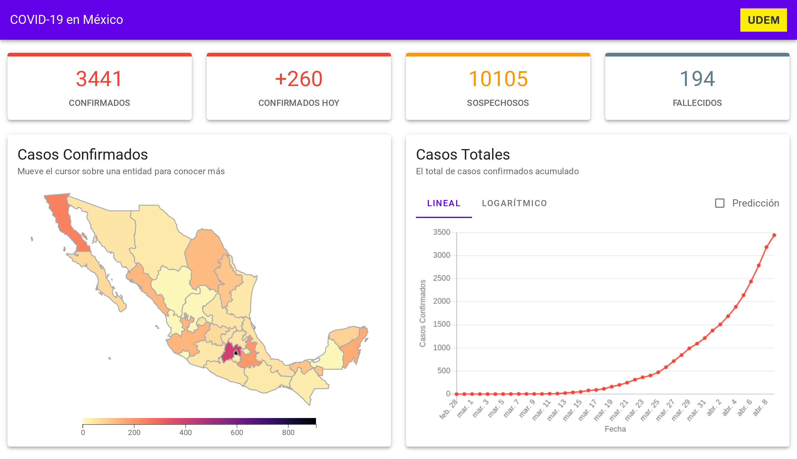

# COVID-19 Dashboard for Mexico

## https://covid19.newtondreams.com



## Background

This project started as a response to the lack of visual tools for understanding the development of the COVID-19 disease in Mexico.

## Data Source

All data is obtained from Mexico Public Health Ministry (Secretaría de Salud). Source links are displayed in the website.

## For Developers

- Required Node.js version: 12.16.1.
- Uses Vue and Vuetify

```
# install dependencies
$ npm install -y
```

To start a development server

```
$ npm run serve
```

To build production level files

```
$ npm run build
```

To deploy the built files to a FTP server

- Configure the FTP credentials by creating a .env file using the .env.example template.

```
$ npm run deploy
```

## Credits

- favicon.ico made by <a href="" title="Freepik">Freepik</a> from <a href="https://www.flaticon.com/" title="Flaticon">www.flaticon.com</a>
